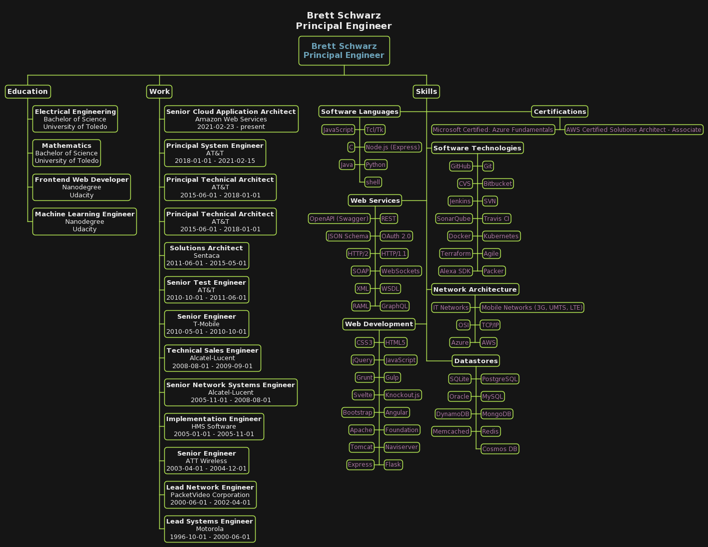

  <button class="tablinks button" onclick="openTab('text')">Text Resume</button>
  <button class="tablinks button" onclick="openTab('diagram')">Graphiical Resume</button>

# {{ site.data.resume.basics.name }}



    
        <i class="fab fa-linkedin-in igreen" aria-hidden="true"></i>
    

    <a href="{{ prof.url }}">{{ prof.username }}</a>


<i class="fas fa-envelope igreen" aria-hidden="true"></i>
[{{ site.data.resume.basics.email }}](mailto:{{ site.data.resume.basics.email }})

{{ site.data.resume.basics.location.city }},{{ site.data.resume.basics.location.region }},{{ site.data.resume.basics.location.postalCode }} {{ site.data.resume.basics.location.countryCode }}


<i class="fas fa-map-marker-alt igreen" aria-hidden="true"></i>
[{{ location }}]({{ "https://www.google.com/maps/place/" | append: location }})

***

## Overview
{{ site.data.resume.basics.summary }}

***

## Experience

### {{ job.position }}
**{{ job.company }}** ({{ job.startDate | date: "%B %Y" }} - {{ job.endDate | date: "%B %Y" | default: "present" }})

{{ job.summary }}
<ul>

<li> {{ hl }} </li>

</ul>


***


### {{ skill.name }}


<code class="highlighter-rouge">{{ key }}</code>




***


### {{ ed.area }}
**{{ ed.institution }}**

{{ ed.studyType }}



***
## Publications



### {{ pub.name }}
[{{ pub.publisher }}](pub.website) ({{ pub.releaseDate | date: "%B %Y"}})

{{ pub.summary }}



***
## Languages
<table>

<tr>
<td><strong>{{ lang.language}}</strong></td>

<td>||||||||||</td>


<td>||||||||||</td>


<td>||||||||||</td>


<td>||||||||||</td>


<td>||||||||||</td>


<td></td>
<td></td>
<td></td>
<td></td>
<td></td>
</tr>

</table>

***
## References


**{{ ref.name }}**
>{{ ref.reference | strip_newlines }}


